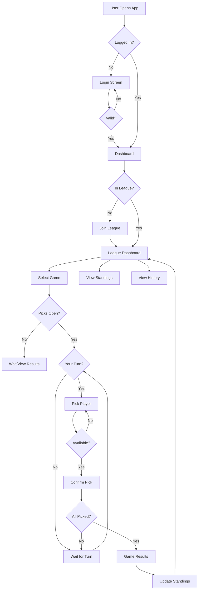

```mermaid
flowchart TD
    A[User Opens App] --> B{Logged In?}
    B -->|No| C[Login Screen] --> D{Valid?}
    D -->|No| C
    D -->|Yes| E[Dashboard]
    B -->|Yes| E
    
    E --> F{In League?}
    F -->|No| G[Join League] --> H[League Dashboard]
    F -->|Yes| H
    
    H --> I[Select Game]
    I --> J{Picks Open?}
    J -->|No| K[Wait/View Results]
    J -->|Yes| L{Your Turn?}
    
    L -->|No| M[Wait for Turn] --> L
    L -->|Yes| N[Pick Player]
    N --> O{Available?}
    O -->|No| N
    O -->|Yes| P[Confirm Pick]
    
    P --> Q{All Picked?}
    Q -->|No| M
    Q -->|Yes| R[Game Results]
    R --> S[Update Standings]
    S --> H
    
    H --> T[View Standings]
    H --> U[View History]
```
